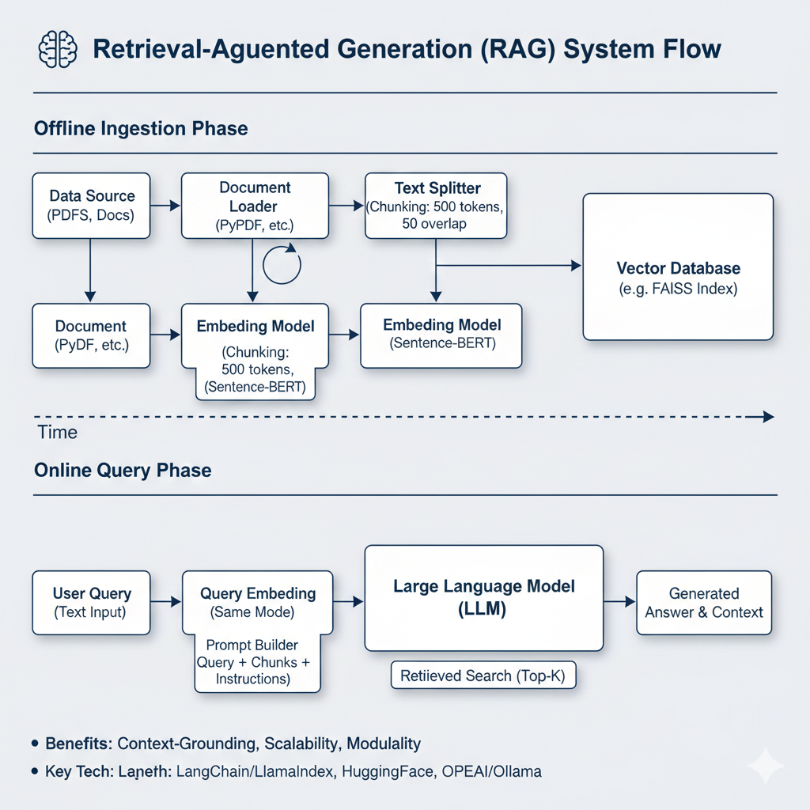
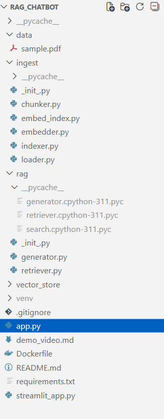
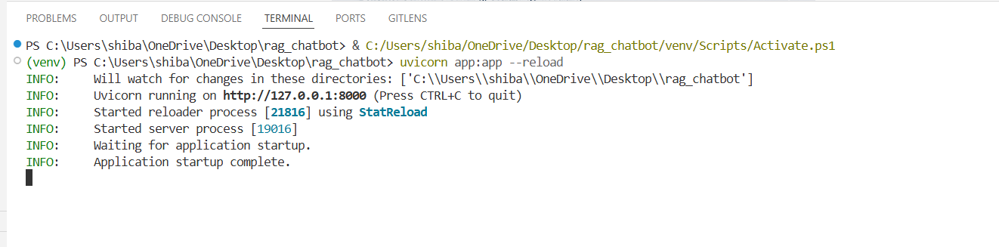
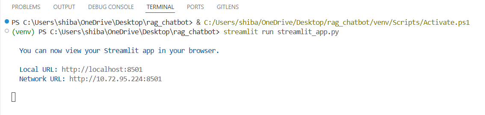
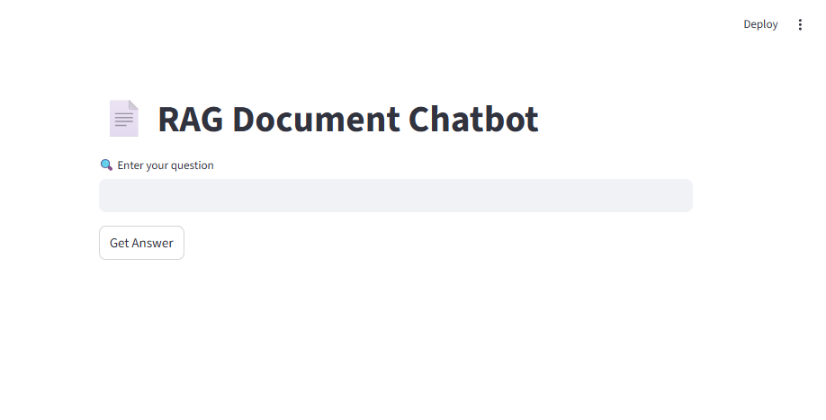
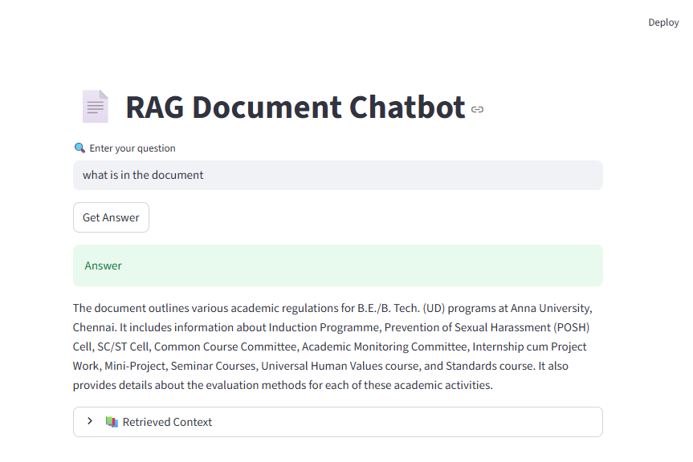
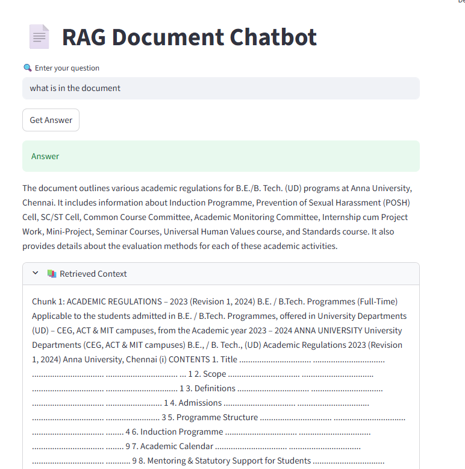

# RAG-Based Document Question Answering Chatbot

A production-ready Retrieval-Augmented Generation (RAG) system that enables natural language question answering over PDF documents with high accuracy and minimal hallucinations.

## Problem Statement

Large Language Models (LLMs) cannot reliably answer questions about private or custom documents (PDFs, reports, internal notes) as these are not part of their training data. Directly prompting an LLM with entire documents is:
- **Inefficient** – Large context windows are slow and expensive
- **Unreliable** – Prone to hallucinations beyond context limits
- **Impractical** – Cannot scale to large document collections

## Solution Overview

This project implements a **Retrieval-Augmented Generation (RAG)** pipeline that:
1. Retrieves only the most relevant document chunks using vector similarity search
2. Injects retrieved context into the LLM prompt
3. Grounds answers strictly in retrieved content to prevent hallucinations

### System Architecture



```
PDF Document
   ↓
Text Extraction
   ↓
Text Chunking
   ↓
Embedding Generation
   ↓
Vector Store (FAISS)
   ↓
Query Embedding → Semantic Retrieval
   ↓
Context-Grounded LLM Generation
   ↓
User Interface
```

## Key Features

✅ **Offline RAG System** – Works without internet connectivity  
✅ **Local LLM Integration** – Uses Ollama for private, cost-free inference  
✅ **Fast Semantic Search** – FAISS-powered vector similarity  
✅ **Modular Architecture** – Clean separation of concerns  
✅ **Production-Ready** – Designed for scalability and deployment  

## Tech Stack

| Component | Technology |
|-----------|-----------|
| Backend | FastAPI |
| Frontend | Streamlit |
| Vector Store | FAISS |
| Embeddings | Sentence Transformers |
| LLM | Ollama (Local) |
| Language | Python 3.10+ |

## Project Structure

```
rag-chatbot/
│
├── ingest/
│   ├── embedder.py          # Embedding generation
│   └── indexer.py           # FAISS index management
│
├── rag/
│   ├── retriever.py         # Semantic chunk retrieval
│   └── generator.py         # LLM answer generation
│
├── vector_store/
│   ├── index.faiss          # FAISS vector index
│   └── chunks.pkl           # Document chunks
│
├── utils/
│   └── load_pdf.py          # PDF text extraction
│
├── assets/                  # Screenshots and diagrams
├── api.py                   # FastAPI backend
├── streamlit_app.py         # Streamlit UI
├── requirements.txt
└── README.md
```


*Project organization in VS Code*

## Installation & Setup

### Prerequisites
- Python 3.10 or higher
- Ollama installed ([Installation Guide](https://ollama.ai))

### 1. Clone Repository
```bash
git clone https://github.com/your-username/rag-document-chatbot.git
cd rag-document-chatbot
```

### 2. Create Virtual Environment
```bash
python -m venv venv

# Windows
venv\Scripts\activate

# macOS/Linux
source venv/bin/activate
```

### 3. Install Dependencies
```bash
pip install -r requirements.txt
```

## Running the Application

### Start FastAPI Backend
```bash
uvicorn api:app --reload
```

Backend available at: `http://127.0.0.1:8000`


*FastAPI server running successfully*

### Start Streamlit Frontend
```bash
streamlit run streamlit_app.py
```


*Streamlit application startup*

## How It Works

1. **User Query** – User enters a question in the Streamlit UI
2. **Query Embedding** – Question is converted to a vector representation
3. **Semantic Retrieval** – FAISS retrieves top-k relevant chunks
4. **Context Injection** – Retrieved chunks are added to the LLM prompt
5. **Answer Generation** – LLM generates a grounded response
6. **Response Display** – Answer and source context shown to user

## Screenshots

### Main Interface

*Clean, intuitive interface for document upload and question answering*

### Query Results

*Example showing answer generation with retrieved context*

### Retrieved Context Display

*Transparent display of source chunks used for answer generation*

## Deployment Notes

### Local Deployment
The system works out-of-the-box with Ollama installed locally.

### Cloud Deployment

**Option 1: Keep Ollama**
- Install Ollama on server
- Ensure FAISS index is rebuilt in production environment

**Option 2: Use Managed LLM APIs**
- Replace Ollama with OpenAI/HuggingFace/Anthropic API
- Update `generator.py` with API credentials
- Modify endpoint configurations

**Docker Deployment**
```bash
# Build Docker image
docker build -t rag-chatbot .

# Run container
docker run -p 8000:8000 -p 8501:8501 rag-chatbot
```

**Production Checklist:**
- [ ] Replace `127.0.0.1` with production hostname
- [ ] Disable `--reload` flag in uvicorn
- [ ] Set up environment variables for secrets
- [ ] Configure CORS policies
- [ ] Implement rate limiting

## Challenges & Learnings

### Cloud Service Constraints
During development, I explored managed LLM platforms including AWS Bedrock and Azure AI. However, free-tier access required credit card verification, and Azure student subscriptions imposed regional and service-level restrictions that limited experimentation.

**Solution:** I opted for locally hosted inference using Ollama, which provided:
- Unrestricted testing without token limits
- Faster iteration cycles
- No dependency on cloud credits
- Full control over model selection

This approach allowed me to prioritize RAG architecture correctness and system design over cloud provisioning complexity.

## Future Enhancements

- [ ] Multi-document upload and indexing
- [ ] Persistent chat history
- [ ] Hybrid search (BM25 + dense retrieval)
- [ ] Re-ranking for improved retrieval
- [ ] Support for multiple file formats (DOCX, TXT, HTML)
- [ ] Containerized deployment with Docker Compose
- [ ] User authentication and document permissions

## Demo

See [demo_video.md](demo_video.md) for a complete walkthrough.

## Author

**Shibani M** – CSE III Year  
Interests: AI | NLP | RAG Systems | Backend Development

---

**License:** MIT  
**Contributions:** Issues and pull requests welcome!