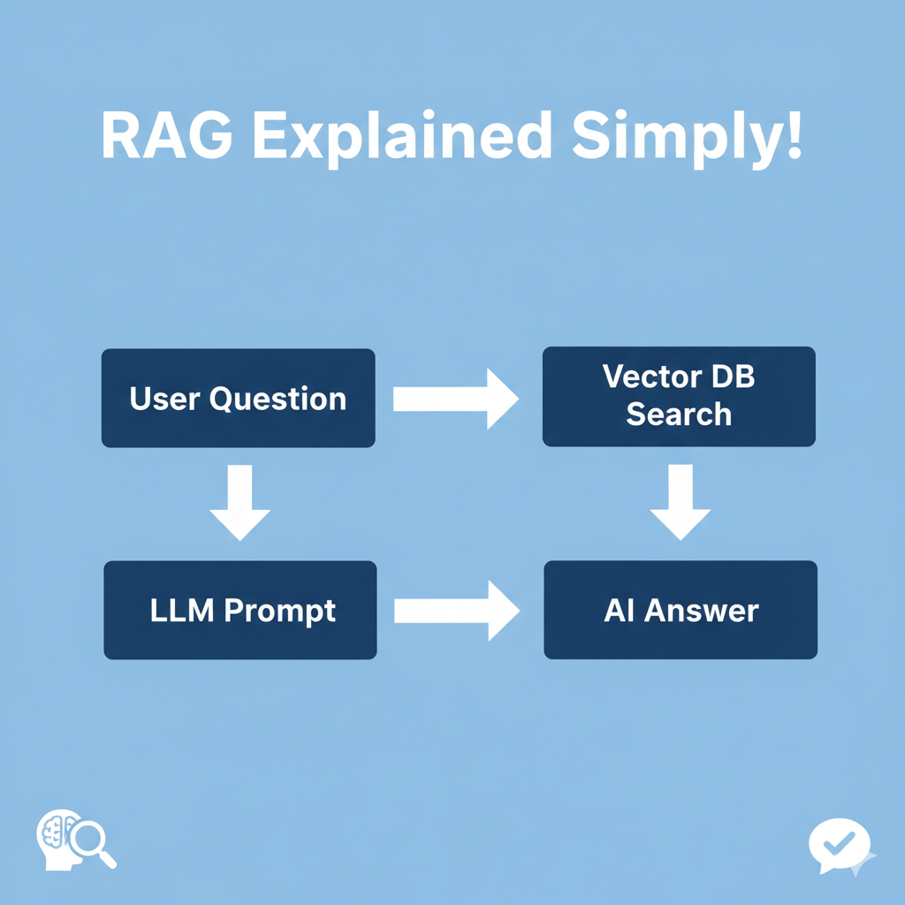

# Demo Video - RAG Document QA Chatbot

## 🎥 Complete Project Walkthrough

Watch the full technical demonstration and explanation of the RAG-based Document Question Answering Chatbot:

**👆 Click the image above to watch on YouTube**

---

## 📺 Direct Links

- **YouTube:** [https://youtube.com/watch?v=kistRP-iPfw](https://youtube.com/watch?v=kistRP-iPfw)
- **Duration:** ~9 minutes
- **Target Audience:** AI/ML Engineers, Technical Recruiters, Researchers

---

## 📑 Video Contents & Timestamps

| Time | Section | Key Topics |
|------|---------|------------|
| 0:00 - 0:40 | **Introduction** | Project overview, goals, and agenda |
| 0:40 - 1:40 | **Problem Statement** | LLM limitations with private documents, context window issues |
| 1:40 - 2:30 | **Why RAG?** | Conceptual explanation of Retrieval-Augmented Generation |
| 2:30 - 4:00 | **Architecture Overview** | Offline ingestion phase & online query phase |
| 4:00 - 5:30 | **Code Walkthrough** | PDF loader, chunker, embedder, FAISS, retriever, generator |
| 5:30 - 6:30 | **Backend & Frontend** | FastAPI REST API & Streamlit UI implementation |
| 6:30 - 7:30 | **AI Models & Services** | SentenceTransformer, FAISS, Ollama/Mistral |
| 7:30 - 8:30 | **Challenges & Learnings** | Hallucination control, chunk optimization, system design |
| 8:30 - 9:00 | **Conclusion** | Project summary and real-world applications |

---

## 🎯 What You'll Learn

### 1. **Problem & Solution Architecture**
- Why traditional LLMs fail on private documents
- How RAG solves context window limitations
- Trade-offs between efficiency and accuracy

### 2. **Technical Implementation**
- **PDF Processing:** Text extraction with PyPDF
- **Text Chunking:** Overlapping chunks for semantic continuity
- **Embedding Generation:** SentenceTransformer (all-MiniLM-L6-v2)
- **Vector Storage:** FAISS for fast similarity search
- **Retrieval:** Top-K semantic chunk retrieval
- **Generation:** Context-grounded LLM responses via Ollama

### 3. **System Design Decisions**
- Modular architecture (ingestion vs. query phases)
- Prompt engineering to prevent hallucinations
- Clean separation between backend (FastAPI) and frontend (Streamlit)
- Local LLM deployment for privacy and cost-effectiveness

### 4. **Challenges Overcome**
- Controlling LLM hallucinations through strict prompting
- Optimizing chunk size and overlap ratios
- Balancing retrieval accuracy vs. system performance
- Choosing appropriate embedding models

---

## 🛠️ Technologies Demonstrated

### Core AI/ML Stack
- **Embeddings:** Sentence Transformers (all-MiniLM-L6-v2)
- **Vector Search:** FAISS (Facebook AI Similarity Search)
- **LLM:** Mistral via Ollama (local inference)
- **NLP:** PyPDF for text extraction, custom chunking logic

### Application Framework
- **Backend:** FastAPI with RESTful endpoints
- **Frontend:** Streamlit for interactive UI
- **Language:** Python 3.10+

### Production Considerations
- Extensible to cloud services (Azure AI Foundry, AWS Bedrock)
- Modular design for easy maintenance
- Scalable vector storage architecture

---

## 💡 Key Takeaways

This video demonstrates:

✅ **End-to-end RAG implementation** from ingestion to generation  
✅ **Production-ready architecture** with clean code organization  
✅ **Practical AI engineering** beyond theoretical concepts  
✅ **Real-world problem solving** with modern LLM techniques  
✅ **System design thinking** for scalable AI applications  

---

## 🎓 Intended Audience

This demonstration is designed for:
- **AI/ML Engineers** evaluating RAG implementations
- **Technical Recruiters** assessing internship candidates
- **Students** learning practical NLP system design
- **Researchers** exploring production RAG architectures

---

## 🔗 Related Resources

- **GitHub Repository:** [rag-document-chatbot](https://github.com/ShibaniPraiseline/rag_chatbot)
- **Full Documentation:** [README.md](./README.md)
- **Source Code:** Browse implementation details in the repo
- **Tech Stack Details:** See README for complete dependencies

---

## 📝 Video Script

The video follows a structured technical presentation covering:
1. Clear problem definition
2. Solution architecture explanation
3. Code implementation walkthrough
4. Design decisions and trade-offs
5. Challenges faced and solutions implemented
6. Practical learnings and applications

---

## 💬 Questions & Feedback

**Have questions about the implementation?**

- Check the [README](./README.md) for detailed setup instructions

**Want to connect?**
- LinkedIn: [Your LinkedIn Profile](https://www.linkedin.com/in/shibani-m-804203317/)
- Email: your.email@example.com

---

## 🏆 Project Context

This project was developed as part of an AI/ML engineering portfolio, demonstrating:
- Practical understanding of RAG systems
- Ability to implement production-ready AI solutions
- Knowledge of modern NLP and vector search technologies
- Clean code architecture and system design principles

---

**Created by:** Shibani M | CSE III Year  
**Institution:** [Your College Name]  
**Focus Areas:** AI | NLP | RAG Systems | Backend Development  
**Last Updated:** January 2026

---

## 🚀 Next Steps

After watching this video:
1. Clone the repository and try it yourself
2. Experiment with different documents and queries
3. Extend the system with additional features
4. Deploy to cloud platforms (AWS/Azure/GCP)

**Ready to build your own RAG system?** Check out the [installation guide](./README.md#installation--setup)!